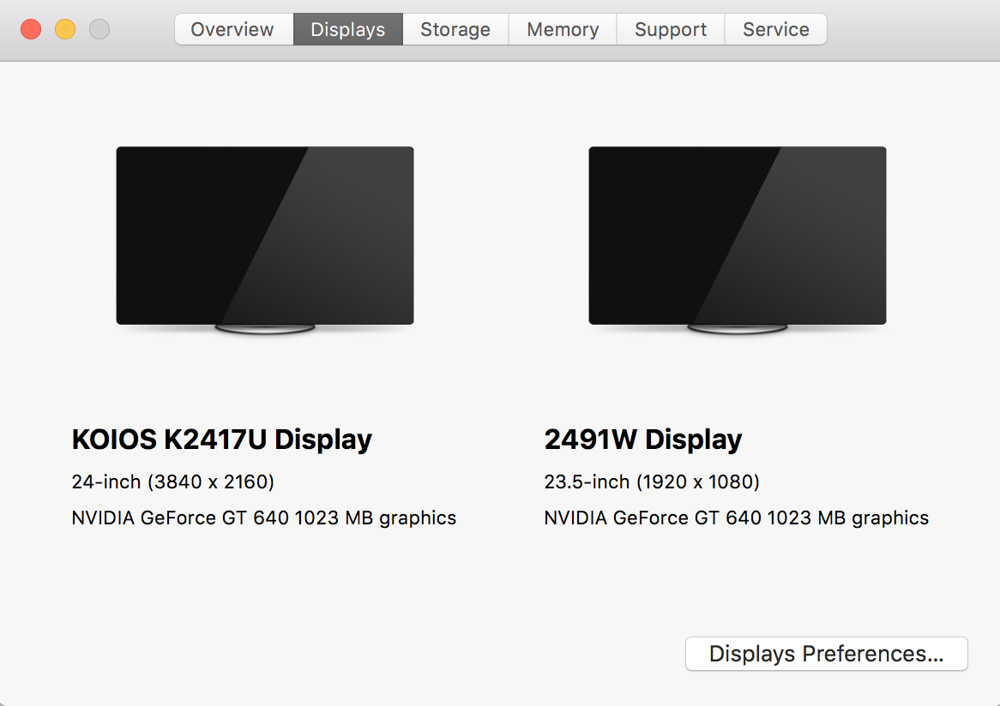

# MSI_B250M-E_EFI
微星B250M-E i5-7500 GT640黑苹果 EFI

微星B250M-E这个主板比较低端，只有HDMI1.4+VGA的接口，所以即使i5-7500的HD630支持4K/60Hz显示器，也无法使用。即使不用4K显示器这个主板使用黑苹果是无法接两个显示器，因为VGA接口太老了，黑苹果没办法支持。所以如果需要使用两个显示器以及4K显示器，必须额外加一个独立显卡。

我是加了一个独立显卡NVIDIA GeForce  GT640，有DP，HDMI,接口，支持一个4K，一个1080P显示器还行。某宝价格100出头。需要注意这块显示最高支持到macOS 10.13.6。

## 配置

- CPU: Intel i5-7500
- 主板: [微星 B250M-E (MS-7A74)](https://cn.msi.com/Motherboard/B250M-E/Specification)
- 内存: 威刚8G/2400Hz + 宇瞻8G/2400Hz
- 硬盘: 宇瞻 AS340 240GB 
- 显卡: NVIDIA GeForce  GT640
- 显示器
  - KOIOS K2417U DP1.2   4K分辨率
  - AOC 2491W HDMI 1.4   1080P

## 正常使用

- macOS版本 10.3.15
- 双显示器正常使用，一个显示器4K自动开启hiDPI, 另一个1080P手动开启hiDPI
- 外接显示器声音正常输出
- CPU温度，风扇速度显示正常

## 问题

- 偶尔编译或者跑一些应用的时候，鼠标会转圈卡一下，不确定是性能问题还是黑苹果的问题。

